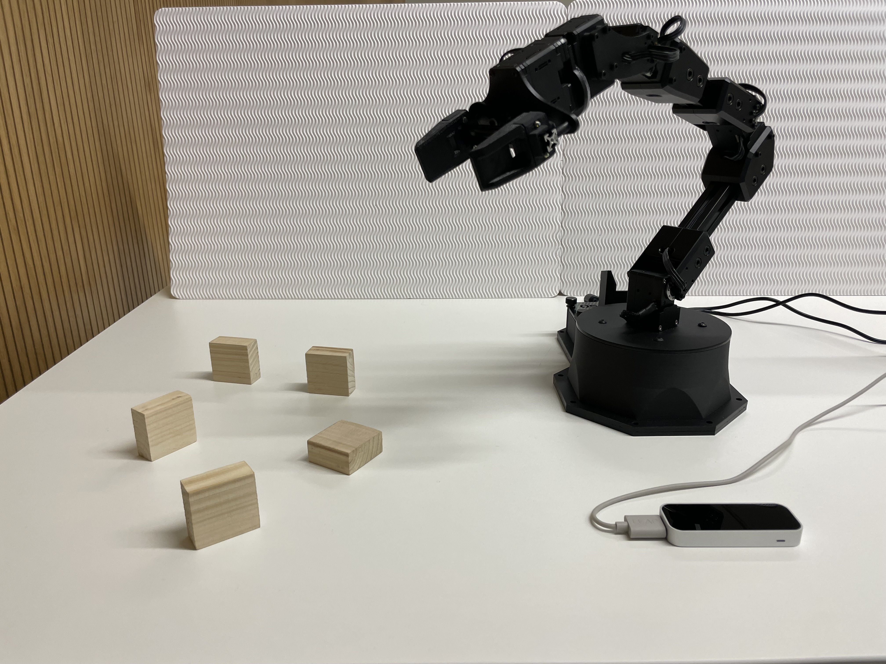

## What is HRI? 
Human Robot Interaction(HRI) is the field of studies dedicated to the understanding and evaluation of robotic systems for the use by or with humans. This interaction involves the communication or direct involvement with someone or something. In our case this refers to the constant communication between the robot and the human via messages. Among the different types of interactions we can find visual interaction, touch interaction or sound interaction. 

Consequently, this project aims to develop different concepts for the cooperation between an industrial-like robot and a human operator. For this purpose, the sensor systems LeapMotion and Astra are used to determine the motion of the human operator. The motion is provided directly in a skeleton model. Thus the robot(ReactorX-150) acquires the ability to interact in the smoothest possible way.

## Requierments and supported platforms
### Supported platforms/releases:

|Platform|ROS Release|
|-|------|
|[Ubuntu 20.04](https://releases.ubuntu.com/20.04/)|[ROS Noetic](https://wiki.ros.org/noetic/Installation/Ubuntu)|

### Requirements: 

You should have the [Leap Motion SDK](https://developer.leapmotion.com/tracking-software-download), [Python 2](https://www.python.org/downloads/release/python-272) and [Python 3](https://www.python.org/downloads/) installed on your device. 

## Documentation and Enviornment setup
For guidance on installation, development, environmental setup, and troubleshooting, see our [documentation](). This documentation includes a description of the sensors and the robot arm which were used to develop and test the industrial-like interaction.

## Current features
- [Pick up and delivery of an object/piece while hand is being hold inside the sensor working area](/scripts/demonstrator_hold_hand)
- [Pick up an object once a signal is given to the robot](/scripts/Industrial_like_robot)
- [Delivery of an object once the a hand is detected again](/scripts/Industrial_like_robot)
- [Pick up and delivery of differnt objects/pieces placed in different locations]((/scripts/Industrial_like_robot))
- Determinations of the hands status

## Installation of this package
**1.** Go to the source folder of your catkin workspace.
```bash 
cd ~/catkin_ws/src
@@ -38,8 +20,3 @@ catkin_make
```bash 
source ~/catkin_ws/devel/setup.bash
```
**3.** Extract the LeapMotion folder and place it in your desired location outside your catkin working space.

**4.** Go to the [Leap_client_demonstrator.py](/scripts/demonstrator_hold_hand/Leap_client_demonstrator.py) file and change the path in line 8 based on the location where you placed the folder LeapMotion.

**5.** Go to the [Leap_client_industrial.py](/scripts/Industrial_like_robot/Leap_client_industrial.py) file and change the path in line 8 based on the location where you placed the folder LeapMotion.
